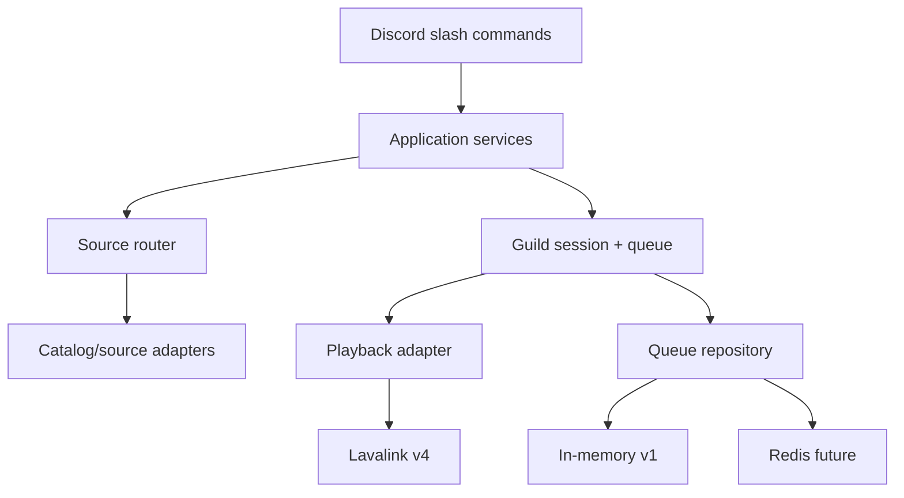

# Rencana Perancangan Instruksi Komprehensif — Discord Music Bot v2

Status: Draft untuk ditinjau sebelum implementasi  
Tanggal acuan teknis: 24 Agustus 2026

## 1. Tujuan dokumen

Dokumen ini adalah rencana untuk menulis instruksi implementasi yang akan menghasilkan Discord music bot dengan sasaran berikut:

- `/play <judul/artis>` dapat mencari dan memutar musik tanpa URL.
- `/play <URL>` dapat mengenali tautan lagu atau playlist yang didukung.
- Playlist dapat dimasukkan ke antrean sekaligus, bukan satu lagu per command.
- Fitur inti `play`, `skip`, dan `queue` benar-benar berfungsi end-to-end.
- Pengguna menerima feedback yang jelas saat proses berhasil, gagal, atau hanya berhasil sebagian.
- State dan antrean terpisah untuk setiap Discord server.
- Arsitektur dapat berkembang dari in-memory menuju Redis, persistent queue, beberapa worker, dan observability.
- Kode memiliki komentar yang menjelaskan keputusan penting, bukan komentar yang hanya mengulang syntax.

Dokumen ini belum meminta AI menulis seluruh kode sekaligus. Tujuannya adalah menetapkan kontrak, batasan, arsitektur, fase implementasi, dan kriteria lulus terlebih dahulu.

---

## 2. Ringkasan rekomendasi

### Stack utama yang direkomendasikan

- Python 3.12 atau versi stabil yang masih didukung.
- `discord.py` 2.7.x untuk bot dan native slash commands.
- Wavelink 3.5.x sebagai client Lavalink untuk Python.
- Lavalink v4 sebagai node audio terpisah.
- Docker Compose untuk menjalankan bot dan Lavalink secara konsisten.
- `pytest`, `pytest-asyncio`, Ruff, dan Pyright/mypy untuk verifikasi.
- In-memory queue repository untuk MVP.
- `redis.asyncio` sebagai implementasi repository tambahan pada fase persistence.

Versi exact wajib dikunci di lockfile saat implementasi. Jangan menggunakan tag Docker `latest` pada deployment production.

### Alasan memilih stack ini

1. `discord.py` cukup ramah untuk proyek pertama dan mendukung native application commands.
2. Wavelink menyediakan API asynchronous dan mendukung Lavalink v4.
3. Lavalink memisahkan proses pencarian, decoding, dan pengiriman audio dari proses utama bot. Jika audio bermasalah, command layer dan domain queue tidak perlu ikut dibongkar.
4. Lavalink v4 saat ini mendukung DAVE, yang penting karena Discord mewajibkan E2EE untuk voice mulai Maret 2026.
5. Source adapter dan repository interface membuat YouTube/Spotify/Redis dapat diganti tanpa mengubah command contract.

Referensi utama:

- [Discord Application Commands](https://docs.discord.com/developers/interactions/application-commands)
- [Discord Voice Connections](https://docs.discord.com/developers/topics/voice-connections)
- [discord.py](https://pypi.org/project/discord.py/)
- [Wavelink](https://github.com/PythonistaGuild/Wavelink)
- [Lavalink](https://github.com/lavalink-devs/Lavalink)

---

## 3. Decision gate: arti “play dari Spotify/YouTube”

Bagian ini wajib ada di awal instruksi final. Tanpa keputusan ini, AI cenderung membuat klaim yang secara teknis atau kebijakan tidak benar.

### 3.1 Spotify bukan sumber full-audio umum untuk Discord bot

Spotify Web API terutama menyediakan metadata dan kontrol terhadap pengalaman Spotify yang diizinkan; API playlist bukan URL stream lagu penuh. Audio preview juga deprecated, dapat bernilai `null`, dan tidak boleh dijadikan layanan audio mandiri.

Perubahan Development Mode 2026 juga penting:

- Pemilik app Development Mode harus memiliki Spotify Premium aktif.
- App baru dibatasi hingga lima pengguna yang diizinkan.
- Endpoint playlist baru adalah `GET /playlists/{id}/items`, bukan endpoint lama `/tracks`.
- Dalam Development Mode, isi playlist hanya tersedia untuk playlist milik pengguna yang sedang login atau playlist yang ia kolaborasikan.
- Pagination endpoint baru maksimal 50 item per halaman, bukan 100.
- Akses playlist pengguna membutuhkan OAuth Authorization Code; Client Credentials tidak dapat mengakses resource milik pengguna.

Referensi:

- [Spotify February 2026 migration guide](https://developer.spotify.com/documentation/web-api/tutorials/february-2026-migration-guide)
- [Spotify Get Playlist Items](https://developer.spotify.com/documentation/web-api/reference/get-playlists-items)
- [Spotify Authorization](https://developer.spotify.com/documentation/web-api/concepts/authorization)

### 3.2 Mengubah metadata Spotify menjadi audio dari layanan lain bukan jaminan production-compliant

Pola populer “ambil judul dari Spotify, lalu cari audio yang cocok di YouTube” memang dapat dibuat secara teknis dengan plugin seperti LavaSrc. Namun, Spotify Developer Policy melarang produk yang mengintegrasikan stream atau konten dari layanan lain. Kebijakan tersebut juga membatasi webcasting satu sumber kepada banyak pendengar.

Karena itu, instruksi final tidak boleh menyebut pola tersebut sebagai “Spotify streaming resmi”. Sebut dengan jujur sebagai resolusi metadata lintas sumber dalam mode prototype, dengan risiko perubahan, pemblokiran, dan review kebijakan sebelum bot dipublikasikan.

Referensi: [Spotify Developer Policy](https://developer.spotify.com/policy)

### 3.3 Ekstraksi audio YouTube juga memiliki risiko kebijakan dan stabilitas

YouTube API policy melarang pemisahan audio dari video dan background play melalui API service. Plugin YouTube Lavalink atau `yt-dlp` dapat bekerja secara teknis, tetapi bukan jalur playback resmi yang dijamin stabil oleh YouTube. Situs dapat berubah dan extractor dapat berhenti bekerja.

Referensi:

- [YouTube API Services Developer Policies](https://developers.google.com/youtube/terms/developer-policies-guide)
- [Lavalink plugins](https://lavalink.dev/plugins.html)

### 3.4 Dua mode yang harus dibedakan

| Mode                  | Sasaran                    | Spotify/YouTube                                                                                                 | Kapan dipakai                             |
| --------------------- | -------------------------- | --------------------------------------------------------------------------------------------------------------- | ----------------------------------------- |
| Compliance-first      | Bot publik/komersial       | Hanya integrasi dan sumber audio yang mendapat izin; Spotify/YouTube tidak dijanjikan sebagai full-audio source | Sebelum distribusi publik                 |
| Self-hosted prototype | Belajar dan server pribadi | Lavalink YouTube plugin dan optional LavaSrc, disertai batasan dan adapter yang mudah diganti                   | Untuk mencapai UX eksperimen yang diminta |

Asumsi kerja rencana ini: **self-hosted prototype di test server**, nonkomersial, dengan source adapters terpisah. Sebelum bot menjadi publik, lakukan review ulang terhadap terms dan ganti sumber yang tidak memenuhi izin.

---

## 4. Prinsip desain instruksi final

Instruksi implementasi yang baik harus memaksa AI mengikuti prinsip berikut:

1. Slash commands saja untuk interaksi utama. Jangan menyamarkan prefix command `commands.command` sebagai slash command.
2. Jangan meminta `message_content` privileged intent bila bot hanya menggunakan slash commands.
3. Semua operasi yang mungkin lebih dari satu detik harus melakukan defer pada interaction terlebih dahulu.
4. Domain queue tidak boleh mengetahui detail Discord, Spotify, YouTube, Wavelink, atau Redis.
5. Jangan menyimpan signed/temporary audio URL di persistent queue. Simpan reference dan resolve ulang just-in-time ketika akan diputar.
6. Semua mutasi session per guild harus diserialisasi dengan lock.
7. Hanya boleh ada satu playback coordinator aktif per guild.
8. Error internal dicatat ke log dengan correlation ID; pengguna menerima pesan aman dan mudah dipahami.
9. Retry hanya untuk error transient. Jangan retry input invalid atau 403.
10. Setiap fase harus memiliki test dan exit criteria sebelum fase berikutnya.
11. Tidak boleh ada `TODO`, placeholder, command kosong, atau klaim “production-ready” jika alur belum diuji.
12. Komentar menjelaskan alasan, invariants, race-condition prevention, dan trade-off; bukan menjelaskan baris trivial.

Discord mewajibkan initial interaction response dalam tiga detik, lalu token follow-up berlaku 15 menit. Karena itu, `/play`, impor playlist, dan pencarian harus memakai defer lalu mengedit respons awal atau mengirim follow-up. Referensi: [Discord interaction responses](https://docs.discord.com/developers/interactions/receiving-and-responding).

---

## 5. Scope fitur

### 5.1 MVP wajib

- `/play query:<teks-atau-url>`
  - Teks biasa mencari lagu tanpa URL.
  - Default memilih hasil teratas secara otomatis.
  - URL dikenali melalui source router.
  - Jika bot belum terhubung, bot masuk ke voice channel pengguna.
  - Jika player idle, lagu pertama langsung diputar.
  - Jika player aktif, hasil ditambahkan ke antrean.
- `/skip count:1`
  - Melewati satu atau beberapa lagu secara atomik.
  - Tidak memicu dua lagu berikutnya akibat race antara command dan track-end event.
- `/queue page:1`
  - Menampilkan lagu sekarang dan antrean berikutnya.
  - Pagination 10 item per halaman.
- `/pause`
- `/resume`
- `/stop`
  - Menghentikan playback, membatalkan import aktif, membersihkan queue, lalu disconnect.
- `/nowplaying`
- Auto-play lagu berikutnya saat track selesai.
- Auto-disconnect setelah queue kosong dan voice channel idle selama waktu yang dapat dikonfigurasi.
- Queue dan player state terpisah per guild.
- User feedback untuk success, partial success, dan failure.

### 5.2 Playlist wajib

- YouTube playlist URL pada mode prototype.
- Spotify playlist pada mode yang dipilih dan benar-benar tersedia untuk app tersebut.
- Semua item playlist dimasukkan melalui satu `/play`.
- Urutan asli dipertahankan secara default.
- Progress message diedit, bukan mengirim satu pesan per lagu.
- Batas `MAX_PLAYLIST_TRACKS` dapat dikonfigurasi; default yang disarankan 500.
- Item unavailable, local file, episode yang tidak didukung, `null`, atau gagal resolve dilewati dan dihitung.
- Hasil akhir menunjukkan `added`, `skipped`, `failed`, dan apakah hasil dipotong oleh batas.
- Queue tidak menjadi setengah rusak bila import dibatalkan atau gagal.

### 5.3 Kontrol lanjutan setelah MVP

- `/remove position`
- `/clear`
- `/move from_position to_position`
- `/loop mode:<off|track|queue>`
- `/shuffle`
- `/volume percent:<0-100>` dengan default dan maksimum yang aman.
- `/playnext query` untuk memasukkan lagu setelah current track.
- `/search query` atau parameter `choose:true` untuk menampilkan lima hasil dalam select menu.
- Optional DJ role untuk command yang mengubah banyak state.

### 5.4 Di luar scope awal

- Autoplay recommendation tanpa permintaan pengguna.
- Lyrics dari layanan pihak ketiga.
- Equalizer/filter kompleks.
- Dashboard web.
- Multi-region active-active voice session.
- Monetisasi.
- Saved favorites dan user analytics.

Item di luar scope tidak boleh disisipkan oleh AI sebelum MVP lulus.

---

## 6. Kontrak command

| Command       | Input                            | Perilaku sukses                                           | Validasi penting                                             |
| ------------- | -------------------------------- | --------------------------------------------------------- | ------------------------------------------------------------ |
| `/play`       | `query` wajib, `choose` optional | Search/resolve, enqueue, lalu start bila idle             | Harus di guild dan user berada di voice channel              |
| `/skip`       | `count` default 1                | Lewati sejumlah track dan mulai track valid berikutnya    | User harus satu voice channel dengan bot                     |
| `/queue`      | `page` default 1                 | Tampilkan current + queue page                            | Page harus berada dalam range                                |
| `/pause`      | Tidak ada                        | Pause current track                                       | Player harus sedang playing                                  |
| `/resume`     | Tidak ada                        | Resume current track                                      | Player harus paused                                          |
| `/stop`       | Tidak ada                        | Stop, cancel import, clear, disconnect                    | Konfirmasi ringkas; idempotent                               |
| `/nowplaying` | Tidak ada                        | Tampilkan title, artist, duration, requester, source link | Jangan klaim progress presisi jika node tidak menyediakannya |
| `/remove`     | `position`                       | Hapus queue entry yang dipilih                            | Current track tidak dihitung sebagai posisi queue            |
| `/loop`       | `mode`                           | Ubah loop mode guild                                      | Enum saja, bukan arbitrary string                            |
| `/volume`     | `percent`                        | Ubah volume guild                                         | Clamp/tolak di luar range                                    |

Aturan umum:

- Command kontrol harus menolak pengguna yang tidak berada di voice channel yang sama dengan bot.
- Error validasi dikirim ephemeral.
- Now-playing dan queue boleh public agar semua anggota channel melihat state yang sama.
- `/stop` bersifat idempotent: menjalankannya saat tidak ada session tetap memberi respons normal, bukan stack trace.
- Nama command dan option harus mengikuti batas Discord application commands.

---

## 7. Alur `/play` tanpa URL

Alur ini harus ditulis eksplisit di instruksi final karena merupakan kebutuhan utama.

1. Terima `query` sebagai string bebas, misalnya `numb linkin park`.
2. Defer interaction segera.
3. Validasi guild, voice state pengguna, permission bot, dan panjang input.
4. Normalisasi whitespace tetapi jangan merusak Unicode.
5. Classifier menentukan apakah input merupakan URL yang didukung atau search text.
6. Untuk search text, panggil search provider melalui `PlaybackResolver.search(query, limit=5)`.
7. Pada `choose=false`, pilih hasil teratas yang playable.
8. Pada `choose=true`, tampilkan select menu lima hasil yang hanya dapat digunakan requester dan timeout otomatis.
9. Buat `QueueEntry` dari metadata stabil. Jangan simpan temporary stream URL.
10. Di dalam per-guild lock, append entry dan tentukan apakah coordinator perlu mulai.
11. Jika session idle, playback coordinator resolve track just-in-time dan memutarnya.
12. Edit original response: `Ditambahkan: Judul — Artis • posisi #N` atau `Sedang memutar: ...`.

Contoh acceptance:

```text
/play query:separate ways journey
```

Hasil yang diharapkan:

- Tidak meminta URL.
- Bot mencari sumber yang dikonfigurasi.
- Hasil teratas dimasukkan ke queue.
- Pesan menyebut judul yang benar-benar dipilih, requester, dan posisi queue.

---

## 8. Alur playlist

### 8.1 Pipeline umum

1. Defer interaction.
2. Parse dan validasi URL dengan parser domain-aware; jangan hanya menggunakan pemeriksaan substring.
3. Ambil metadata playlist dan total item bila tersedia.
4. Tolak atau truncate secara eksplisit bila melewati batas.
5. Iterasi pagination/lazy batches.
6. Normalisasi setiap item menjadi `TrackReference`.
7. Jangan resolve semua temporary audio URL di awal.
8. Batch append ke repository dalam critical section singkat.
9. Update progress maksimal setiap N item atau setiap beberapa detik untuk menghindari rate limit Discord.
10. Start playback segera setelah batch pertama valid tersedia; import sisanya boleh dilanjutkan di background job terkontrol.
11. Ketika selesai, edit progress message dengan summary.

### 8.2 Spotify official adapter

- Gunakan OAuth Authorization Code untuk resource pengguna.
- Scope minimum: `playlist-read-private` hanya jika private playlist memang dibutuhkan.
- Gunakan endpoint baru `GET /playlists/{id}/items`.
- `limit` maksimal 50 dan teruskan sampai `next == null` atau mencapai batas bot.
- Baca objek `item`, bukan field lama `track`.
- Handle `items` yang tidak tersedia dengan error `PlaylistAccessDenied` yang mudah dipahami.
- Honor HTTP 429 `Retry-After`; gunakan jitter kecil setelah waktu tunggu.
- Jangan menggunakan preview URL sebagai full playback.
- Jangan log access token, refresh token, authorization code, cover-art signed URL, atau response body yang memuat data sensitif.

### 8.3 Prototype adapter

Jika pemilik proyek memilih LavaSrc/YouTube plugin untuk server pribadi:

- Tempatkan seluruh kode di adapter `infrastructure/sources/prototype/`.
- Tambahkan feature flag `SOURCE_POLICY_MODE=prototype`.
- Startup harus mencatat warning yang jelas tetapi tidak mengirim token/secret.
- README harus menjelaskan bahwa keberhasilan sumber tidak dijamin dan terms perlu ditinjau sebelum distribusi.
- Domain, command, dan queue tidak boleh bergantung pada class plugin secara langsung.

---

## 9. Arsitektur target



### 9.1 Layer dan tanggung jawab

#### Discord presentation layer

- Slash command definitions.
- Permission dan voice-channel checks yang berkaitan dengan Discord.
- Defer/edit/follow-up interaction.
- Embed dan select menu.
- Menerjemahkan domain error menjadi pesan pengguna.

Tidak boleh berisi algoritma pagination playlist atau manipulasi queue langsung.

#### Application layer

- `PlayRequestService`
- `QueueControlService`
- `PlaylistImportService`
- `PlaybackCoordinator`
- Orkestrasi transaction/lock.

Layer ini menggunakan interfaces/ports dan tidak mengimpor implementation detail Redis atau Spotify SDK.

#### Domain layer

- `QueueEntry`
- `TrackReference`
- `GuildSession`
- `LoopMode`
- `PlaybackState`
- Queue invariants dan domain errors.

Domain harus dapat diuji tanpa koneksi Discord, jaringan, Docker, atau Lavalink.

#### Infrastructure layer

- Wavelink/Lavalink playback adapter.
- YouTube/search adapter.
- Spotify official OAuth adapter.
- Optional prototype/LavaSrc adapter.
- In-memory repository.
- Redis repository.
- Structured logging dan metrics exporters.

---

## 10. Model data minimum

### `TrackReference`

```text
id: UUID
source_type: youtube | spotify | direct | prototype
source_id: string | null
source_uri: string | null
search_hint: string
title: string
artists: list[string]
duration_ms: int | null
thumbnail_url: string | null
canonical_url: string | null
is_stream: bool
```

### `QueueEntry`

```text
id: UUID
guild_id: DiscordSnowflake
track: TrackReference
requested_by_user_id: DiscordSnowflake
requested_in_channel_id: DiscordSnowflake
enqueued_at: UTC datetime
playlist_context: {playlist_id, playlist_name, position} | null
attempt_count: int
```

### `GuildSession`

```text
guild_id
voice_channel_id
text_channel_id
state: disconnected | connecting | idle | playing | paused | stopping
current_entry: QueueEntry | null
upcoming: ordered collection[QueueEntry]
loop_mode: off | track | queue
volume: int
generation: int
idle_deadline: UTC datetime | null
```

`generation` atau playback token digunakan untuk mengabaikan track-end event lama setelah `/skip`, `/stop`, reconnect, atau replacement player.

Jangan menyimpan raw Discord objects, Wavelink player objects, access token, atau temporary audio URL di model persistent.

---

## 11. Queue dan concurrency rules

1. Satu `asyncio.Lock` per guild untuk mutasi session.
2. Network I/O tidak boleh dilakukan sambil menahan lock kecuali benar-benar perlu.
3. Playlist fetch dilakukan di luar lock; append batch dilakukan cepat di dalam lock.
4. Hanya `PlaybackCoordinator` yang boleh memindahkan `upcoming` menjadi `current_entry`.
5. `/skip` menaikkan `generation`, menghentikan track sekarang, dan meminta coordinator memilih next track.
6. Track-end event membawa atau dibandingkan dengan generation/identifier current track. Event stale diabaikan.
7. `/stop` membatalkan background import melalui cancellation token/event sebelum clear queue.
8. Dua `/play` yang datang bersamaan harus mempertahankan urutan commit yang deterministik.
9. Setelah N track gagal berturut-turut, coordinator berhenti dan meminta intervensi pengguna agar tidak membuat infinite skip loop.
10. Loop track tidak menambah duplicate entry ke queue. Loop queue memindahkan entry selesai ke ujung dengan aturan yang diuji.

Redis tidak menggantikan single-owner rule. Pada multi-process deployment, satu guild hanya boleh dimiliki satu shard/worker voice session. Redis digunakan untuk persistence dan coordination metadata, bukan membiarkan dua player mengontrol guild yang sama.

---

## 12. Repository contract agar Redis mudah ditambahkan

Instruksi final harus meminta protocol/interface berikut, dengan nama yang boleh disesuaikan:

```text
QueueRepository
  get_session(guild_id) -> GuildSession
  append(guild_id, entries, expected_version) -> new_version
  pop_next(guild_id, expected_version) -> QueueEntry | null
  remove(guild_id, position, expected_version) -> QueueEntry
  move(guild_id, from, to, expected_version) -> new_version
  clear(guild_id, expected_version) -> new_version
  save_playback_state(guild_id, state, expected_version) -> new_version
```

Gunakan optimistic version atau transaction semantics agar implementasi Redis dapat mendeteksi lost update. Implementasi in-memory tetap harus mengikuti contract yang sama.

Strategi recovery yang aman:

- Queue boleh dipulihkan setelah restart.
- Bot tidak otomatis masuk kembali ke voice channel tanpa kebijakan eksplisit.
- Default: session ditandai `restorable`; pengguna menjalankan `/resumequeue` atau `/play` untuk memulai ulang.
- Exact timestamp resume bukan requirement awal; lanjutkan dari awal current track atau track berikutnya sesuai setting yang terdokumentasi.

---

## 13. Error model dan user feedback

### 13.1 Typed errors

| Error                   | Pesan pengguna                                                    | Retry otomatis                                            |
| ----------------------- | ----------------------------------------------------------------- | --------------------------------------------------------- |
| `UserNotInVoice`        | “Masuk ke voice channel terlebih dahulu.”                         | Tidak                                                     |
| `DifferentVoiceChannel` | “Kamu harus berada di voice channel yang sama dengan bot.”        | Tidak                                                     |
| `BotMissingPermission`  | Sebut permission yang kurang                                      | Tidak                                                     |
| `UnsupportedSource`     | “Tautan ini belum didukung.”                                      | Tidak                                                     |
| `TrackNotFound`         | “Lagu tidak ditemukan. Coba tambahkan nama artis.”                | Tidak                                                     |
| `PlaylistAccessDenied`  | Jelaskan batas owner/collaborator atau OAuth                      | Tidak                                                     |
| `PlaylistTooLarge`      | Tampilkan jumlah dan batas                                        | Tidak; user dapat konfirmasi truncate bila fitur tersedia |
| `SourceRateLimited`     | “Sumber sedang membatasi permintaan; mencoba lagi dalam N detik.” | Ya, ikuti `Retry-After`                                   |
| `SourceTimeout`         | “Sumber musik terlalu lama merespons.”                            | Maksimal 2–3 kali dengan backoff+jitter                   |
| `LavalinkUnavailable`   | “Layanan audio sedang tidak tersedia.”                            | Reconnect terbatas                                        |
| `PlaybackFailed`        | Sebut track dilewati; lanjutkan bila aman                         | Ya untuk next track                                       |
| `InternalError`         | Pesan aman + correlation ID                                       | Tidak secara buta                                         |

### 13.2 Aturan error handling

- Jangan mengirim `str(exception)` mentah kepada pengguna.
- Jangan menangkap semua error lalu menganggap command berhasil.
- `CancelledError` harus diteruskan setelah cleanup.
- 400/401/403 tidak di-retry secara otomatis.
- HTTP 429 mengikuti `Retry-After`.
- 5xx, disconnect, dan timeout dapat di-retry dengan batas.
- Playlist partial failure menghasilkan summary, bukan menggagalkan semua track yang sudah valid.
- Log harus menyertakan `guild_id`, `command`, `requester_id`, `correlation_id`, source, latency, dan outcome.
- Log tidak boleh berisi Discord token, Spotify secret/token, Lavalink password, cookie, atau temporary stream URL.

### 13.3 Pola feedback

- Initial: “Mencari…” atau “Memuat playlist…” setelah defer.
- Progress playlist: satu pesan yang diedit, misalnya `Memuat 100/240 • 96 valid • 4 dilewati`.
- Success single track: judul, artist, requester, posisi queue.
- Success playlist: playlist name, added/skipped/failed/truncated.
- Failure: penyebab yang dapat ditindaklanjuti pengguna.

---

## 14. Struktur proyek target

```text
discord-music-bot/
├── pyproject.toml
├── uv.lock atau lockfile setara
├── .env.example
├── .gitignore
├── README.md
├── docker-compose.yml
├── Dockerfile
├── lavalink/
│   └── application.yml.example
├── src/
│   └── musicbot/
│       ├── __init__.py
│       ├── __main__.py
│       ├── bot.py
│       ├── settings.py
│       ├── commands/
│       │   ├── music.py
│       │   └── checks.py
│       ├── application/
│       │   ├── play_service.py
│       │   ├── queue_service.py
│       │   ├── playlist_import_service.py
│       │   └── playback_coordinator.py
│       ├── domain/
│       │   ├── models.py
│       │   ├── queue.py
│       │   ├── state.py
│       │   └── errors.py
│       ├── ports/
│       │   ├── playback.py
│       │   ├── sources.py
│       │   └── repositories.py
│       ├── infrastructure/
│       │   ├── lavalink/
│       │   ├── spotify/
│       │   ├── sources/
│       │   └── repositories/
│       ├── presentation/
│       │   ├── embeds.py
│       │   └── views.py
│       └── observability/
│           ├── logging.py
│           └── metrics.py
└── tests/
    ├── unit/
    ├── integration/
    └── e2e/
```

Jangan commit `.env`, cookies, token cache, log runtime, Lavalink password, atau Spotify refresh token.

---

## 15. Environment configuration minimum

```env
DISCORD_TOKEN=
DISCORD_APPLICATION_ID=
DISCORD_TEST_GUILD_ID=

LAVALINK_URI=http://lavalink:2333
LAVALINK_PASSWORD=

SOURCE_POLICY_MODE=prototype
SPOTIFY_CLIENT_ID=
SPOTIFY_CLIENT_SECRET=
SPOTIFY_REDIRECT_URI=

QUEUE_BACKEND=memory
REDIS_URL=redis://redis:6379/0

MAX_PLAYLIST_TRACKS=500
QUEUE_MAX_TRACKS=1000
IDLE_DISCONNECT_SECONDS=300
DEFAULT_VOLUME=70
LOG_LEVEL=INFO
```

Settings harus divalidasi saat startup. Jika fitur Spotify dimatikan, credential Spotify boleh kosong. Jika `QUEUE_BACKEND=redis`, startup harus gagal dengan pesan jelas bila `REDIS_URL` tidak valid.

---

## 16. Fase implementasi yang harus digunakan dalam instruksi final

### Fase 0 — Policy dan keputusan produk

Output:

- Pilih `compliance-first` atau `self-hosted prototype`.
- Putuskan apakah Spotify hanya untuk playlist own/collaborator via OAuth atau memakai prototype adapter.
- Tetapkan platform deployment: Windows local + Docker Desktop untuk pengembangan, Linux VPS/Docker untuk production-like test.
- Tetapkan batas playlist dan queue.

Exit criteria:

- Tidak ada kalimat ambigu “Spotify memutar full audio lewat Web API”.
- Risiko source tercatat di README/ADR.

### Fase 1 — Scaffold dan quality gates

Output:

- Struktur package.
- Typed settings dan `.env.example`.
- Bot login, shutdown handler, command sync untuk test guild.
- Docker Compose bot + Lavalink.
- Ruff, type checker, pytest.
- Structured logging dasar.

Exit criteria:

- Bot online.
- `/health` atau startup health check memastikan Lavalink dapat dijangkau.
- Test, lint, dan type check lulus.
- Tidak memakai `message_content` intent.

### Fase 2 — Domain queue dan session state

Output:

- Domain models, errors, in-memory repository, per-guild lock registry.
- Queue operations dan loop semantics.
- Unit tests untuk queue, position, clear, loop, version conflict.

Exit criteria:

- Domain tests tidak membutuhkan Discord/Lavalink.
- Dua guild tidak berbagi state.
- Race-condition cases memiliki test.

### Fase 3 — Discord command shell dan voice lifecycle

Output:

- Slash commands dan checks.
- Deferred interactions.
- Join/move/disconnect lifecycle.
- Safe same-channel control rule.
- Error-to-message mapping.

Exit criteria:

- Semua command merespons sebelum timeout interaction.
- Permission dan voice-state errors ramah pengguna.
- `/stop` idempotent.

### Fase 4 — Search text dan single-track playback

Output:

- Source router.
- Wavelink/Lavalink playback adapter.
- `/play <judul>` auto-select top result.
- Direct supported URL handling.
- Track-end event dan autoplay next.
- `/skip`, `/pause`, `/resume`, `/queue`, `/nowplaying` end-to-end.

Exit criteria:

- `/play query:judul artis` bekerja tanpa URL.
- Dua lagu ditambahkan berurutan dan otomatis lanjut.
- Skip tidak menyebabkan double-advance.
- Source failure tidak mematikan bot process.

### Fase 5 — Playlist import

Output:

- Generic lazy playlist importer.
- YouTube playlist adapter untuk prototype.
- Spotify OAuth + endpoint `/items` bila official adapter dipilih.
- Progress update, cancellation, max size, partial failure summary.

Exit criteria:

- Playlist 120 lagu melewati setidaknya tiga halaman Spotify berukuran 50 dan urutan tetap benar.
- Satu `/play` menambahkan seluruh playlist yang diizinkan.
- Item unavailable/null dilewati dan dihitung.
- 403 dan 429 menghasilkan perilaku yang tepat.

### Fase 6 — Reliability dan UX polish

Output:

- Reconnect/backoff terbatas.
- Consecutive failure breaker.
- Idle timer.
- Paginated queue view.
- Select menu search optional.
- Metrics dan correlation IDs.

Exit criteria:

- Bot pulih dari node disconnect sesuai kebijakan.
- Tidak ada unbounded task, retry loop, atau message spam.
- Semua command memiliki user feedback yang konsisten.

### Fase 7 — Redis persistence optional

Output:

- Redis repository mengikuti contract yang sama.
- Schema versioning/serialization.
- Optimistic concurrency.
- Restore policy.
- Integration tests menggunakan Redis container.

Exit criteria:

- Mengubah `QUEUE_BACKEND=memory` menjadi `redis` tidak mengubah command code.
- Queue dapat dipulihkan setelah restart sesuai recovery policy.
- Bot tidak otomatis masuk voice channel tanpa izin kebijakan.

### Fase 8 — Deployment dan operations

Output:

- Production Dockerfiles dan pinned images.
- Health/readiness checks.
- Graceful shutdown.
- Resource limits dan restart policy.
- Backup/retention policy bila Redis persistence aktif.
- Runbook troubleshooting.

Exit criteria:

- Fresh clone dapat berjalan dari README.
- Secret tidak masuk image atau repository.
- Shutdown tidak meninggalkan task atau connection terbuka.

---

## 17. Test plan minimum

### Unit tests

- Input classifier membedakan text, Spotify URL, YouTube URL, playlist URL, dan unsupported URL.
- Queue append/remove/move/clear.
- Loop `off`, `track`, dan `queue`.
- Pagination UI.
- Playlist truncation.
- Error mapping.
- Stale playback event diabaikan.
- Concurrent append menghasilkan urutan deterministik.

### Integration tests

- Source adapter dengan mocked HTTP 200/403/429/500/timeout.
- Spotify pagination 120 item dengan page size 50.
- Lavalink load/no-match/playlist/error results.
- Redis repository version conflict.
- Cancellation saat playlist sedang diimpor.

### E2E di Discord test guild

1. `/play` dengan judul tanpa URL.
2. Tambah lagu kedua dan lihat `/queue`.
3. Pause, resume, skip.
4. Playlist kecil, sedang, dan lebih besar dari limit.
5. Dua pengguna menjalankan `/play` hampir bersamaan.
6. Pengguna di voice channel berbeda mencoba `/skip`.
7. Bot kehilangan permission `SPEAK`.
8. Lavalink dimatikan ketika lagu sedang berjalan.
9. Bot dipindahkan atau dikeluarkan dari voice channel.
10. `/stop` saat import playlist berjalan.

### Quality commands

Instruksi final harus menetapkan command nyata, misalnya:

```bash
ruff check .
ruff format --check .
pyright
pytest -q
docker compose config
```

Sesuaikan package manager, tetapi jangan menulis “run tests” tanpa command konkret.

---

## 18. Acceptance criteria produk

Bot baru boleh disebut “fully functional untuk scope MVP” bila seluruh poin berikut terbukti:

- `/play query:<judul>` bekerja tanpa URL dan menyebut hasil yang dipilih.
- `/play` kedua menambahkan lagu ke queue, bukan memotong current track.
- `/skip` selalu maju tepat satu kali untuk default count.
- `/queue` menunjukkan current dan upcoming order yang sama dengan playback aktual.
- Track selesai memulai next track tanpa command tambahan.
- Playlist yang didukung dapat ditambahkan dengan satu command.
- Playlist partial failures tidak merusak item lain dan memiliki summary.
- Queue terpisah untuk minimal dua test guild.
- User di channel berbeda tidak dapat mengontrol player.
- Semua long-running interaction melakukan defer.
- Bot tidak bocor token, secret, stack trace, atau temporary audio URL.
- Tidak ada blocking `time.sleep` atau synchronous network request di event loop.
- Tidak ada `TODO`, `pass`, mock implementation, atau command kosong dalam deliverable production path.
- Lint, type check, unit test, integration test, dan Docker config lulus.
- README dapat dipakai fresh setup di Windows development dan Linux/Docker deployment.

---

## 19. Aturan prompt untuk coding agent

Master instruction nantinya harus memberi aturan kerja berikut kepada AI:

1. Inspect repository sebelum mengubah file.
2. Implementasikan satu fase saja per iterasi.
3. Jangan menghapus atau menulis ulang perubahan pengguna yang tidak terkait.
4. Jelaskan asumsi sebelum coding bila terdapat ambiguity yang memengaruhi arsitektur.
5. Gunakan official/current documentation untuk Discord dan Spotify.
6. Jangan mengarang endpoint atau kemampuan full-audio Spotify.
7. Gunakan dependency lock dan laporkan versi yang dipilih.
8. Setelah edit, jalankan quality commands yang relevan.
9. Jika test gagal, perbaiki sampai lulus atau laporkan blocker dengan bukti.
10. Laporan fase berisi: file berubah, keputusan, hasil verifikasi, known limitations, dan next phase.
11. Jangan memberi komentar pada setiap baris; beri komentar pada alasan dan invariants yang tidak jelas.
12. Jangan menutupi error dengan `except Exception` global yang mengirim pesan sukses.
13. Jangan melakukan network I/O synchronous di event loop.
14. Jangan menyimpan user-facing queue hanya sebagai list global tanpa guild isolation dan lock.
15. Jangan memulai fase Redis sebelum in-memory contract dan tests stabil.

---

## 20. Paket instruksi final yang sebaiknya dibuat

Alih-alih lima file yang saling mengulang kode, gunakan satu source of truth dan beberapa dokumen pendek:

```text
docs/instructions/
├── 00_START_HERE.md
├── 01_PRODUCT_AND_POLICY_DECISIONS.md
├── 02_ARCHITECTURE.md
├── 03_COMMAND_CONTRACTS.md
├── 04_IMPLEMENTATION_PHASES.md
├── 05_ERROR_AND_TEST_MATRIX.md
├── 06_DEPLOYMENT_RUNBOOK.md
└── MASTER_IMPLEMENTATION_INSTRUCTION.md
```

Fungsi setiap dokumen:

- `00_START_HERE.md`: urutan penggunaan dan prerequisites.
- `01_PRODUCT_AND_POLICY_DECISIONS.md`: mode source, batas Spotify/YouTube, dan ADR.
- `02_ARCHITECTURE.md`: layer, models, repository, locking, playback lifecycle.
- `03_COMMAND_CONTRACTS.md`: input, output, permission, state transition.
- `04_IMPLEMENTATION_PHASES.md`: langkah implementasi beserta exit criteria.
- `05_ERROR_AND_TEST_MATRIX.md`: typed errors, retry, unit/integration/E2E.
- `06_DEPLOYMENT_RUNBOOK.md`: local, Docker, VPS, health, troubleshooting.
- `MASTER_IMPLEMENTATION_INSTRUCTION.md`: instruksi ringkas yang menunjuk keenam dokumen sebagai source of truth.

Hindari menyalin starter code besar ke semua dokumen. Duplikasi membuat instruksi cepat basi dan saling bertentangan.

---

## 21. Audit terhadap lima file lama

### Bagian yang tetap berguna

- Daftar fitur dasar dan ide queue per guild.
- Kebutuhan playlist pagination.
- User-friendly embeds dan progress feedback.
- Pemisahan handler Spotify, YouTube, player, dan queue.
- `.env` dan larangan hardcoded credential.
- Gagasan Redis sebagai fase berikutnya.

### Bagian yang harus diperbarui

1. `commands.Bot(command_prefix='/')` bukan implementasi slash command modern.
2. `message_content=True` tidak diperlukan untuk slash-only bot.
3. Spotify `GET /playlists/{id}/tracks` dan field `track` sudah diganti oleh `/items` dan `item` untuk Development Mode 2026.
4. Batas pagination Spotify baru maksimal 50, bukan 100.
5. Client Credentials tidak cukup untuk playlist private/resource pengguna.
6. Isi arbitrary public playlist tidak tersedia melalui endpoint baru di Development Mode kecuali user owner/collaborator; Extended Quota Mode berbeda.
7. Spotify tidak memberi full-track audio URL untuk dimainkan Discord bot.
8. `Spotify metadata -> YouTube audio` harus diberi label prototype/risk, bukan rekomendasi production tanpa catatan.
9. Contoh `background_music_player` yang tidur selama durasi track rentan drift, skip race, pause bug, dan duplicate player task.
10. `asyncio.get_event_loop()` dan executor manual tidak perlu menjadi pola default bila library/HTTP client sudah async.
11. Global `except Exception` yang mengirim `str(e)` membocorkan detail internal.
12. `lru_cache` pada API search tidak menangani TTL, auth context, atau invalidation.
13. Queue berbasis `current_index` tanpa lock dan event token rentan race condition.
14. Dependency versions di dokumen lama sudah basi dan Python 3.8 terlalu tua untuk target baru.
15. “Production-ready code” tidak boleh diklaim sementara command inti masih `TODO/pass`.

Rekomendasi: simpan file lama sebagai referensi, tetapi jadikan paket v2 sebagai source of truth sebelum coding dimulai.

---

## 22. Default keputusan bila implementasi dimulai tanpa pertanyaan tambahan

Untuk mencegah coding agent mengarang keputusan, gunakan default berikut:

- Bahasa: Python 3.12.
- Bot framework: `discord.py` native slash commands.
- Audio: Wavelink + self-hosted Lavalink v4 via Docker Compose.
- Mode: self-hosted prototype di test guild, nonkomersial.
- Text search: hasil teratas langsung dipilih; optional select menu ditambahkan setelah MVP.
- Spotify official path: OAuth Authorization Code, hanya playlist own/collaborator yang memang dapat diakses.
- Optional prototype Spotify adapter: feature flag terpisah dan tidak disebut official streaming.
- Queue backend: in-memory melalui `QueueRepository`.
- Persistence: Redis baru di fase 7.
- Playlist limit: 500; queue limit: 1000.
- Idle disconnect: 5 menit.
- Queue page size: 10.
- UI language: Bahasa Indonesia.
- Development: Windows + Docker Desktop.
- Production-like deployment: Linux VPS + Docker Compose.

Default ini boleh diubah pengguna sebelum Fase 1.

---

## 23. Langkah berikutnya

Setelah rencana ini disetujui:

1. Pilih mode source: compliance-first atau self-hosted prototype.
2. Konfirmasi bahwa Python + Wavelink + Lavalink diterima.
3. Tulis `01_PRODUCT_AND_POLICY_DECISIONS.md` sebagai ADR pertama.
4. Ubah rencana ini menjadi `MASTER_IMPLEMENTATION_INSTRUCTION.md` yang memberi tugas fase demi fase kepada coding agent.
5. Mulai Fase 1; jangan meminta seluruh bot dibuat dalam satu prompt.

Keputusan paling penting sebelum coding adalah cakupan Spotify playlist: **playlist milik/collaborated user melalui OAuth resmi**, atau **arbitrary public playlist melalui adapter prototype yang tidak dijamin resmi/stabil**.
